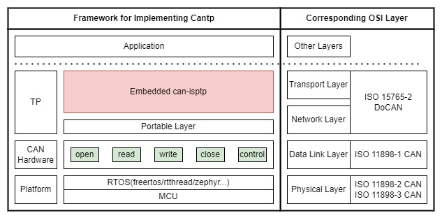

# Embedded-CAN-ISOTP

## Introduction

Embedded-CAN-ISOTP is an embedded implementation of the Transport protocol and network layer services. It is primarily designed for use with RTOS (Real-Time Operating Systems) and provides a portable layer for easy integration. The ISO-TP (ISO Transport Protocol) implemented in this project adheres to the ISO15765-2 standard, ensuring compatibility and standardization. Additionally, the project supports both CAN TP (Controller Area Network Transport Protocol) and CAN FD TP (Controller Area Network with Flexible Data-Rate Transport Protocol), catering to different communication requirements within automotive and embedded systems.

## Framework
### Project desin
The framework for implementing CAN TP (Controller Area Network Transport Protocol) in the Embedded-CAN-ISOTP project is structured as follows:

  

- Application Layer: This layer is where the application interacts with the transport protocol. It is responsible for initiating and managing the communication sessions.
- Transport Layer: The ISO-TP (ISO Transport Protocol) is implemented at this layer. It adheres to the ISO15765-2 standard and provides the necessary transport services for CAN and CAN FD networks. Specific introduction please refer to [Introduction of CAN TP](./CAN_ISO15765.md)
- Portable Layer: This layer provides a set of APIs (Application Programming Interfaces) for the transport protocol. It includes functions for opening, reading, writing, and controlling the CAN hardware. This layer is designed to be portable across different RTOS (Real-Time Operating Systems) and MCU (Microcontroller Unit) platforms.
- CAN Hardware: This layer represents the physical CAN hardware, which is responsible for transmitting and receiving data over the CAN bus. Specifically, it should support CANFD. [introduction of CANFD](./introduction_CANFD.md)
- Platform: This layer includes the RTOS (Real-Time Operating Systems) and MCU (Microcontroller Unit) platforms. The project supports various RTOS platforms such as FreeRTOS, ThreadX, and Zephyr.

### ISO design

  

## Reference opensource projects
This project is inspired by below projects.

1. **[openxc/isotp-c](https://github.com/openxc/isotp-c)** /**[lishen/isotp-c](https://github.com/lishen2/isotp-c)**
    -> Only support CAN CLASSIC
2. **[lishen/can-isotp](https://github.com/hartkopp/can-isotp)**
    -> implementation on linux kernrl 

## Highlight Features of this project
  - **ISO-TP (ISO Transport Protocol) Implementation**: This project implements the ISO15765-2 standard, ensuring compatibility and standardization.
  - **Support CAN and CAN FD**: The project not only supports traditional CAN TP, but also CAN FD TP to meet different communication needs.
  - **Portable layer**: Provides a set of APIs for easy porting and integration on different RTOS and MCU platforms.

## Test environemnt

  

### Testcases
- Single frame transmission test:
Send a data frame of less than 8(CAN) or 64(CANFD) bytes.
Verify whether the receiving end has correctly received the data.

- Multi frame transmission test:
Sending a data frame larger than 8(CAN) or 64(CANFD) bytes requires splitting it into multiple CAN data frames for transmission.
Verify that the receiving end has correctly received all data frames and is able to combine them into complete data.

- Flow control testing:
Simulate that the sending end sends data faster than the receiving end processes data.
Verify whether the receiving end can correctly request the sending end to slow down the sending speed, and notify the sending end to continue sending after the receiving ability is restored.

- Error handling test:
Simulate the sender sending incorrect frame formats or incorrect flow control frames.
Verify whether the receiving end can handle these errors correctly and take corresponding error recovery measures.

- Performance testing:
Test the performance of ISOTP under different loads.
Measure indicators such as throughput, latency, and error rate for data transmission.

- Robustness testing:
Simulate various abnormal situations, such as bus interference, node failures, etc.
Verify whether the ISOTP protocol can maintain stable operation under these abnormal conditions.

- Compatibility testing:
Test the compatibility of ISOTP protocol with ECUs or devices from different manufacturers.
Verify whether the sender and receiver can interact correctly, regardless of the hardware or software implementation used.